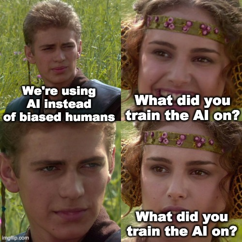

<p align="center">
  
</p>

# Responsible AI: Project 2 (Generative AI Fairness)

This repository contains the materials for **Project 2** of the course **02517 Responsible AI: Algorithmic Fairness and Explainability**.

In this project, you will investigate how bias manifests in large generative language models using the BBQ (Bias Benchmark for QA) dataset. 

## Environment Setup (Google Colab)

To avoid local environment setup issues and ensure you have enough compute power, **we strongly recommend using Google Colab** (which provides free GPU access) to run the Jupyter Notebooks.

**Setup Instructions:**
1. Open [Google Colab](https://colab.research.google.com/).
2. Select **File > Open notebook** and choose the **GitHub** tab.
3. Paste the URL of this repository and open the `BBQ_Project.ipynb` notebook.
4. **Data Access**: Make sure to upload the necessary files from this repository into your Colab environment before running the notebook. You can do this by cloning the repository directly inside a Colab cell:
   ```python
   !git clone https://github.com/ADE-17/RAI_Project2_Gen_AI.git
   ```
   and updating the `BBQ_DIR` path in the notebooks accordingly.
5. **Dependencies**: You can install all required packages by running the following in a Colab cell:
   ```python
   !pip install -r requirements.txt
   ```

## Part II: Competition
As part of your final submission, you will create a custom evaluation dataset designed to expose bias in the models. Upload your custom `custom_dataset.json` to DTU Learn alongside your A0 Poster. The TA will evaluate the first 10 examples from each group on a secret hold-out model to calculate the bias score. 

The team that exposes the most bias wins!

---

**Created and maintained by:**
Aditya Parikh, PhD Student at DTU Compute, Researcher in Responsible AI  
TA for this course. For any doubts or inquiries regarding this repository, please contact me.
